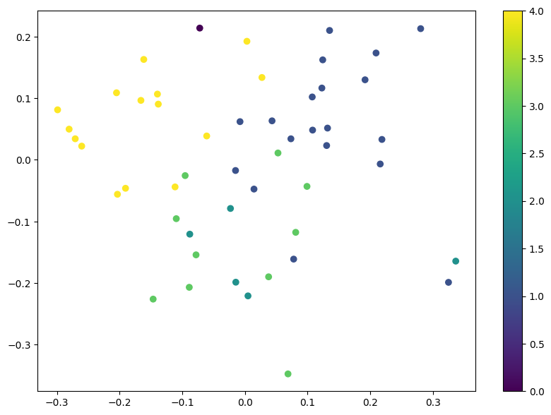
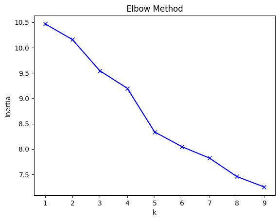

# TEDTalks-SemanticClustering
# TED Talk Topic Clustering

Clustered TED Talk transcripts by topic using **SentenceTransformers** and **KMeans**.

## Project Highlights

- **Text Embedding:** Converted TED Talk transcripts into vector embeddings using `SentenceTransformer('all-MiniLM-L6-v2')` with a **Hugging Face model**.  
- **Chunking Strategy:** Split long transcripts into 500-character chunks to capture semantic content effectively.  
- **Clustering:** Applied **KMeans** to group talks by topic.  
- **Dimensionality Reduction & Visualization:** Reduced embeddings to 2D with **PCA** and visualized clusters.  

- **Cluster Analysis:** Examined cluster distribution, printed sample transcripts, and determined optimal cluster count using **Elbow** and **Silhouette** methods.  

  

## Key Outcomes

- Detected **5 distinct clusters** among the first 50 TED Talks.  
- Sample transcripts from clusters reveal clear topical separation.  
- Visualizations demonstrate how talks group by semantic similarity.

